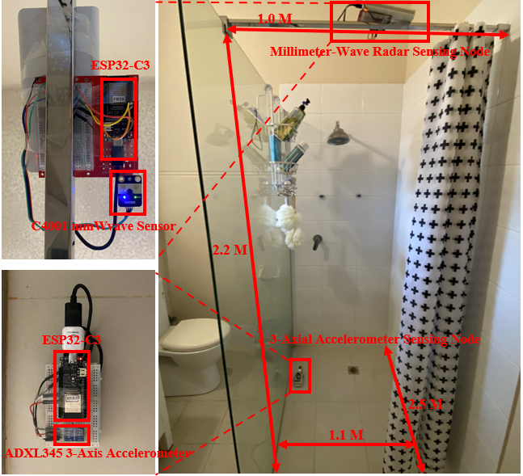
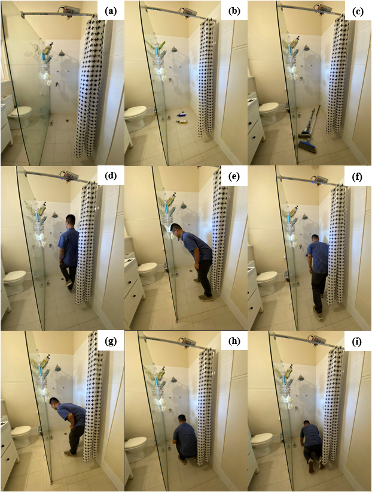

# PPMFD: A Privacy-Preserving Multimodal Fall Detection Network for Elderly Individuals in Bathroom

> **Notice:** Our manuscript is currently under peer review. In the meantime, we have released all data-processing pipelines, feature-extraction scripts, and the PPMFD model code for early access and community feedback. We warmly invite reviewers and fellow researchers to explore the repository, experiment with the AI network, and share your insights or issues. The full multimodal fall-detection dataset will be made publicly available upon publication of the paper.

## Table of Contents
- [1. Introduction](#1-introduction)
- [2. Motivation and Background](#2-motivation-and-background)
- [3. Multimodal Sensor Selection](#3-multimodal-sensor-selection)
- [4. System Setup and Dataset Collection](#4-system-setup-and-dataset-collection)
- [5. Model Architecture](#5-model-architecture)
  - [5.1 Radar Stream](#51-radar-stream)
  - [5.2 Vibration Stream](#52-vibration-stream)
  - [5.3 Feature Fusion and Classifier](#53-feature-fusion-and-classifier)
- [6. Experimental Design](#6-experimental-design)
- [7. Results and Performance](#7-results-and-performance)
  - [7.1 Scenario-wise Metrics](#71-scenario-wise-metrics)
  - [7.2 Comparison with State-of-the-Art](#72-comparison-with-state-of-the-art)
  - [7.3 Ablation Study](#73-ablation-study)
- [8. Conclusion and Future Work](#8-conclusion-and-future-work)
- [9. Main Contributors](#9-main-contributors)

---

## 1. Introduction

Falls are among the leading causes of injury-related deaths in the elderly population. As global aging accelerates, with over 16% of people projected to be aged 65+ by 2050, the demand for reliable, real-time fall detection systems becomes increasingly critical—especially in wet and confined areas like bathrooms, where over 80% of falls occur.

PPMFD (Privacy-Preserving Multimodal Fall Detection) is a robust AI-based fall detection system that integrates mmWave radar and vibration sensors. The network not only delivers high accuracy but also preserves personal privacy by avoiding cameras or wearable sensors, making it ideal for private home environments.

---

## 2. Motivation and Background

Traditional fall detection methods suffer from various limitations. Wearable devices often face poor user compliance and discomfort, especially in wet environments. Camera-based solutions raise significant privacy concerns, particularly in sensitive locations like bathrooms. Audio-based solutions are affected by environmental noise and false positives.

To overcome these challenges, the research focuses on non-intrusive, privacy-aware modalities. However, unimodal systems (e.g., only radar or only vibration) are inherently limited by environmental conditions, leading to system bias and suboptimal performance. This motivated the need for a multimodal fusion system capable of capturing both motion dynamics and impact signals.

---

## 3. Multimodal Sensor Selection

A comprehensive sensor evaluation framework was developed to select the most suitable combination for fall detection in bathroom settings. Fourteen common modalities—including Wi-Fi, infrared, thermal imaging, and vibration—were assessed based on eight criteria: target relevance, recall, energy efficiency, deployability, privacy, availability, and cost.

The final selection was based on a weighted scoring system. As shown below, mmWave radar and 3D vibration sensors achieved the highest usability scores, demonstrating superior suitability for accurate and privacy-conscious monitoring.

---

## 4. System Setup and Dataset Collection

The experiment was conducted in a replicated bathroom environment (2.5m × 1.1m × 2.2m), equipped with typical fixtures like marble walls, a glass partition, anti-slip tiles, and hygiene items. The mmWave radar was mounted at a height of 2.2 meters, while the ADXL345 vibration sensor was installed near the floor under the shower area.

A total of 48 volunteers participated in data collection, simulating 8 types of daily bathroom activities, including both falls and non-fall movements (e.g., walking, squatting, object drops). Over 120,000 vibration samples and 18,000 mmWave point clouds were collected, ensuring high-quality multimodal data.

We have collected and constructed a large‐scale, multimodal fall‐detection dataset specifically for elderly users in bathroom environments. It comprises nine representative scenarios—empty room, light/heavy object drops, normal and bent‐posture walking, wall‐supported walking, static standing, squatting, and intentional falls—each recorded for 20 minutes per scenario (3 hours total). mmWave radar data were sampled at 10 Hz (18 000 point clouds) and triaxial vibration at 100 Hz (over 120 000 samples), enabling robust fusion of macro‐motion and micro‐impact features. **This dataset will be released concurrently with the publication of this paper.**

---

## 5. Model Architecture

PPMFD is a dual-stream multimodal neural network. It combines:
- A **CNN-BiLSTM-Attention** pipeline to analyze mmWave radar signals
- A **Multi-Scale CNN + SEBlock + Self-Attention** pipeline for vibration data
- A fusion module that integrates both feature representations

### 5.1 Radar Stream

The mmWave radar signal is transformed into a temporal sequence of point clouds. These are processed via a 1D CNN to extract local motion features, followed by a BiLSTM layer that models long-range dependencies. Attention weights further enhance informative temporal segments.

### 5.2 Vibration Stream

Vibration data is fed into a Multi-Scale CNN, allowing detection of subtle and high-impact signals. Channel-wise attention (SEBlock) emphasizes dominant signals, and a self-attention mechanism captures temporal dependencies, reducing noise.

### 5.3 Feature Fusion and Classifier

The output of the two streams is concatenated and passed through fully connected layers for final binary classification (fall vs. non-fall). This architecture enables the model to learn both macro-motion and micro-impact patterns.

---

## 6. Experimental Design

Eight real-world scenarios were designed to test system robustness:
1. Empty bathroom
2. Light object drop
3. Heavy object drop
4. Normal walking
5. Bent posture walk
6. Assisted walk (wall-supported)
7. Static standing / squatting
8. Realistic fall

Each activity was performed for approximately 20 minutes. Fall scenarios were simulated under expert supervision. The synchronized multimodal dataset offers a valuable benchmark for future research.

---

## 7. Results and Performance

PPMFD achieved superior performance across all evaluation metrics.

### 7.1 Scenario-wise Metrics

The model maintained high precision and recall in all scenarios. Especially in hard cases like object drops and squatting, the dual-sensor fusion reduced false positives effectively.

### 7.2 Comparison with State-of-the-Art

PPMFD was benchmarked against 16 leading models. Despite similar or slightly lower recall, it outperformed in precision and overall F1-score—an essential trait for reducing false alarms in real environments.

### 7.3 Ablation Study

To validate the effectiveness of each component, an ablation study was performed. Results demonstrate that removing attention or one sensor modality significantly reduces performance. The complete model achieved an accuracy of 95.0% and F1-score of 91.1%.

---

## 8. Conclusion and Future Work

PPMFD provides a privacy-aware, multimodal approach to real-time fall detection in bathrooms. Its dual-stream architecture captures both large-scale movement and localized impacts, ensuring high accuracy in complex, noisy environments.

In the future, we aim to:
- Expand testing to real elderly subjects under long-term deployment
- Develop adaptive thresholding and noise calibration
- Explore lighter edge versions for real-time in-home integration

The dataset and model will be released to promote open research and reproducibility.

## 9. Main Contributors

This work was conducted by a research team from the University of Western Australia (UWA).

### Lead Contributors
- **Haitian Wang** – Lead researcher and project coordinator. Designed the sensor selection framework and supervised overall system integration.
- **Yiren Wang** – Developed the multimodal dataset, led the implementation of the CNN-BiLSTM-Attention pipeline, and conducted extensive experimentation and evaluation.

---

> Contact: haitian.wang@uwa.edu.au  
> Project by: University of Western Australia, Department of Computer Science
